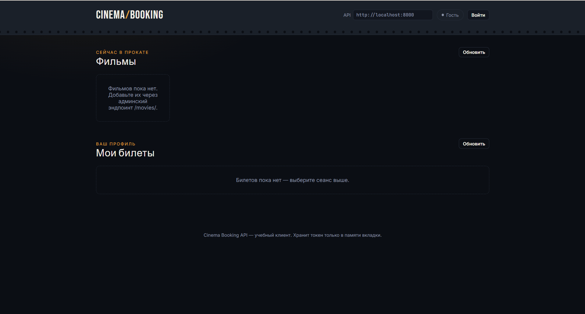
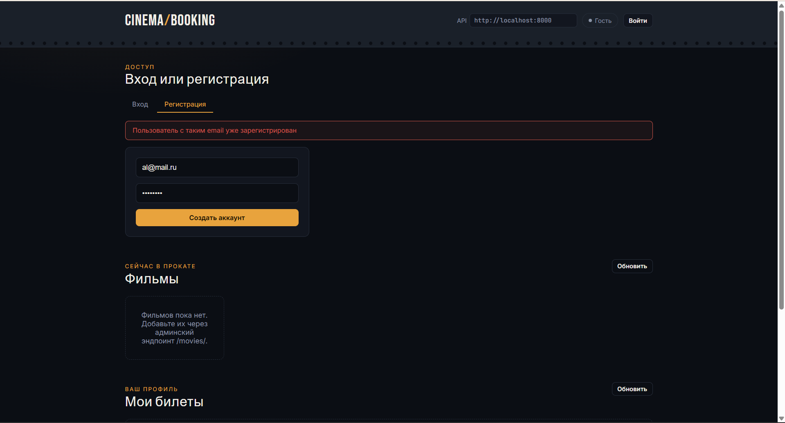
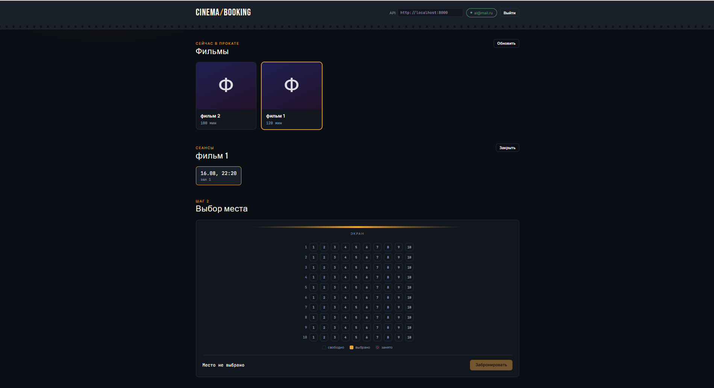
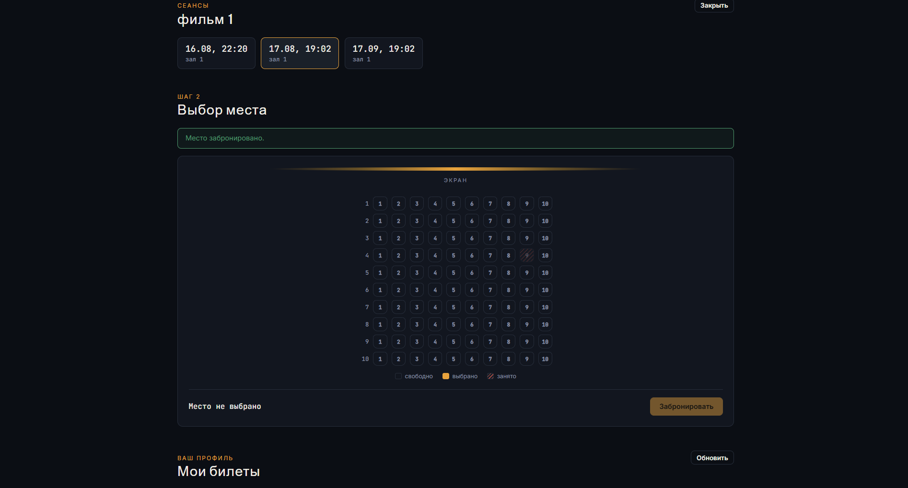
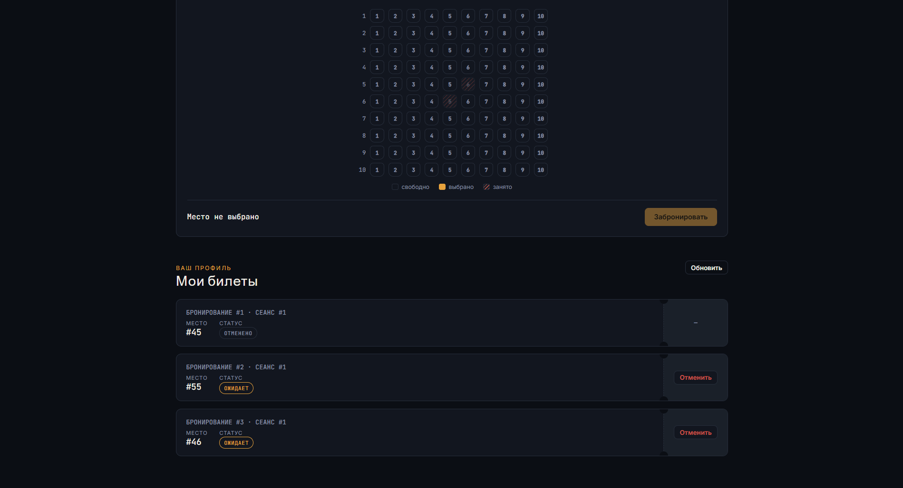
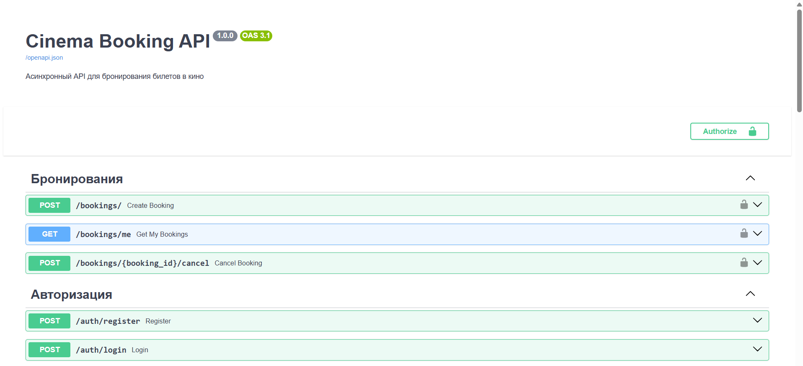
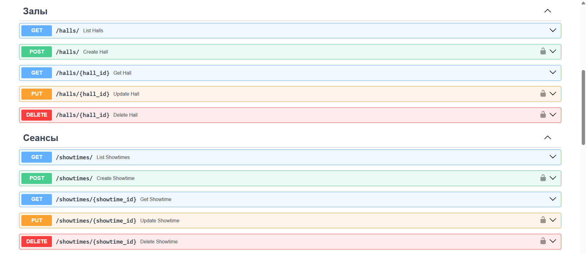
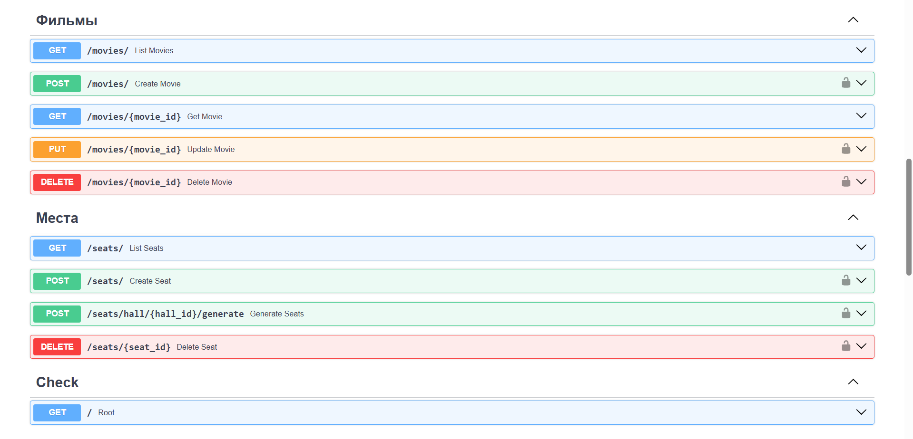

# Cinema Booking API

Асинхронный REST API для системы бронирования билетов в кинотеатр.

## Возможности

- Регистрация и авторизация пользователей (JWT)
- Просмотр карты мест в реальном времени
- Управление структурой кинотеатра (залы, ряды, места) и расписанием сеансов
- Создание фильмов, сеансов и залов
- Простой веб-интерфейс
- Автоматическое снятие брони по истечении тайм-аута при бездействии пользователя

## Технологии

- **FastAPI** — фреймворк
- **Redis** — хранилище для временной блокировки мест
- **PostgreSQL** — база данных
- **SQLAlchemy** — ORM
- **Alembic** — миграции
- **Pydantic** — валидация данных
- **JWT** — авторизация
- **Docker + docker-compose** — запуск
- **pytest** — тестирование

  
   <em>Начальный экран</em>

  
   <em>Экран входа / регистрации с ошибкой</em>

  
   <em>Страница с выбором места</em>

  
   <em>Успешная бронь места</em>

  
   <em>Список с отмененным билетом</em>

  
   <em>Документация</em>

  
   <em>Документация</em>

  
   <em>Документация</em>

